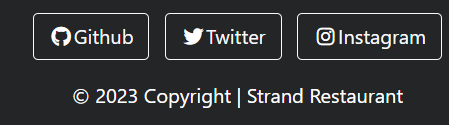
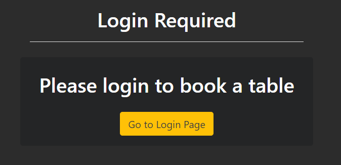
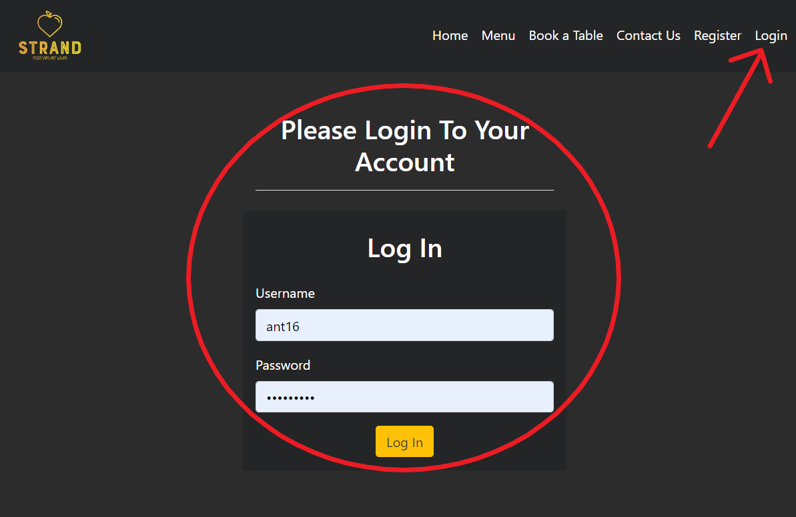
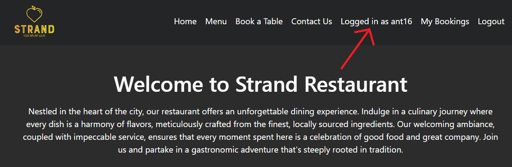

# Strand Restaurant and Bar

**Developer: Anthony Haj Ibrahim**

[Visit live website](https://strand-pp4-d640c87ff185.herokuapp.com/)  

## Table of Contents
  - [About](#about)
  - [User Goals](#user-goals)
  - [Site Owner Goals](#site-owner-goals)
  - [User Stories](#user-stories)
  - [Design](#design)
    - [Colours](#colours)
    - [Fonts](#fonts)
    - [Structure](#structure)
      - [Website pages](#website-pages)
      - [Database](#database)
  - [Technologies Used](#technologies-used)
  - [Features](#features)
  - [Validation](#validation)
  - [Testing](#testing)
    - [Manual testing](#manual-testing)
    - [Tests on various devices](#tests-on-various-devices)
    - [Browser compatibility](#browser-compatibility)
  - [Bugs](#bugs)
  - [Heroku Deployment](#heroku-deployment)
  - [Credits](#credits)
  - [Acknowledgements](#acknowledgements)

## About 

Strand Restaurant and bar is a business where users can book a table, 
create an account, see the menu, or contact the business.

### User Goals

- To be able to view the business menu
- To be able to create an account
- To be able to book a table
- To be able to edit or cancel bookings
- To be able to contact the business 
- To be able to find the business

### Site-owner goals

- To provide a well organized and responsive site
- To have 

## User Stories

### Users

1. As a **User** I can **use the navbar, footer, and social icons** so that I can **navigate the business site**
2. As a **User**, I want to **be able to contact the business using a form** so that **the business can see my contact information and message**
3. As a **User**, I want to see the **restaurant's opening hours and location** so that I can **plan my visit.**
4. As a **User**, I want to see the **menu page** so that **I can explore the dishes offered by the restaurant**
5. As a **User**, I want to **create an account** so that **I can make a booking.**
6. As a **User**, I want to **log in to my account** to **manage my bookings and personal details.**
7. As a **User**, I want to **see my login status (logged in or logged out) and who I am logged in as (username or email) displayed on the website**, so I can **easily understand my current session status**
8. As a **User**, I want to **book a table** so that **I can ensure I have a place at a convenient time.**
9. As a **User**, I cannot **choose a past date while booking** so that **a booking is on a valid date**
10. As a **User**, I am **notified** so that **I know my booking has been booked successfully**
11. As a **User**, I want to **be able to view a booking I have already made** so that **I can see my booking information**
12. As a **User**, I want to **modify my booking details (like time, date, or number of guests)** so that I can **change my plans if needed.**
13. As a **User**, I am **notified when changing my booking information** so that **I know it has been changed successfully**
14. As a **User**, I want to **be able to cancel a booking that I have made**
15. As a **User**, I want **know if I have successfully logged out of my account** 

### Admin

16. As an **Admin**, I want to **be able to log in to the admin interface** so that **I can interact with my app data.**
17. As a **Admin**, I want to **confirm or reject online booking requests** so that **I can manage the restaurant's seating capacity.**
18. As an **Admin**, I want to be able to **create, update, read, and delete** the menu items so that **customers can see current menu and prices**
19. As a **Admin**, I want to **see when a user has submited a contact form with user information and message** so that **I can contact the user**

### Site Owner
20. As a **Site Owner**, I can **ensure that my site is fully responsive** so that **it can be used across all devices**
21. As a **Site Owner**, I can **ensure that my site has data validation** so that **all submitted data is validated to avoid errors**

### Epics and Github Projects
- Github projects was used to track and create user stories
- Epics were created using milestones

!!!!!!!!!!!!!!!!!!!!!!!!!!!!!!!!!!!!!

## Design

### Colors

- The colors I chose consist of dark grays and gold keeping the colors balanced and contrasted well
as a dark theme

See color pallet

### Fonts

- The fonts used were the default Montserrat and sans-serif

## Structure

The site was structured using a basic logo and navigation layout showing all relevant links
and hamburger menu for smaller devices. The footer consists of 3 social media links

### Pages
- Home page with a welcome message, carousel of restaurant images, how to find us section
and contact information/opening hours
- Menu page with all food and drink items shown in cards and sorted by type retrieved from
the database
- Book a Table page where logged in user can fill a form for booking a table at the restaurant
and if a user is not logged in then login_required page will ask user to log in to book
- My bookings page displays all current users bookings and allows user to change or 
cancel a booking they have made
- Change booking page shows a form in which allows the user can change their booking information
- Cancel booking page allows a user to delete a booking they have made and also from the database
- Contact Us page allows a user to submit a contact form with a message with a where to find us and 
contact information/opening hours below the form
- Register page allows the user to register for an account in order to book a table
- Log In page allows user to log into their account to interact with bookings

### Database
- Built with Python and Django with a Postgres database
- Database schema created using dbdiagram.io

See Diagram

#### User Model

The User Model contains:

- user_id
- password
- last_login
- is_superuser
- username
- first_name
- last_name
- email
- is_staff
- is_active
- date_joined

#### FoodItem Model

The FoodItem Model contains

- id 
- food_name
- description
- type
- price

#### DrinkItem Model

The DrinkItem Model contains:

- id 
- food_name
- description
- type
- price

#### Booking Model

The Booking Model contains:

- booking_id (PK)
- created_date
- requested_date
- requested_time
- table (FK)
- guest (FK)
- seats
- guest_count

#### Table Model

The Table Model contains:

- id (PK)
- table_name
- max_seats
- available

#### Contact Model 

The Contact Model contains:

- id (PK)
- name (FK)
- email (FK)
- phone (FK)
- message

## Technologies Used 

### Languages & Frameworks

- HTML
- CSS
- Javascript
- Python
- Django

### Libraries & Tools

- Am I Responsive
- Bootstrap 5
- Font Awesome
- Chrome dev tools
- Pexels.com
- Cloudinary
- Pycharm
- Git
- GitHub
- Heroku 
- jQuery
- Postgres

## Features

### Home page

- Home page contains navigation bar, a body, 3 containers, and a footer

See Feature

### Navigation bar
- Consists of Home, Menu, Book a Table, Contact Us, Register, and Login
- If user is logged in then Log out and, My bookings is displayed instead of Register 
and Login 
- Log in status displayed in when logged in
- Custom logo for the business
- On smaller devices switches to hamburger menu

See Feature

### Footer
- Consists of 3 social media buttons for github, twitter,
and instagram

See Feature

### Menu page

- Displays all food and drink items on the menu
- Food items are first sorted by type for appetizers, main courses,
and desserts
- Drink items are second sorted by type for soft drinks, wines, and beers
- Admins can create, view, add, or delete menu items from the admin panel

See Feature

### Register page

- Contains form for users to register an account
- All fields are required for registration

See Feature

### Login page
- User can login here to book or view bookings 

See Feature

### Book a Table page
- Contains a booking form where user can fill
- All data user enters is validated to avoid booking in the past etc.
- If user is not logged in then they will be asked to log in to book 
a table

See Feature

### My Bookings page
- Users will be able to view, change, or delete their bookings 
on this page
- Bookings are shown in cards with buttons for changing or deleting
- Change buttons redirects user to a form to change their booking
- Cancel button redirects user to confirm if they want to delete their booking

See Feature

### Contact Us page
- Contains a form where the user may submit to get in contact with the 
business, including a message
- This page also contact a how to find us and business contact information
as well as opening hours

See Feature

## Validation

### HTML Validation

#### The W3C Markup Validation Service

Home page

Menu page

Register page

Login page

Logout page

Book a Table page

My Bookings page

Change Booking page

Delete Booking page

Contact Us page

404 page

### CSS Validation

#### The W3C Jigsaw CSS Validation Service

style.css

### JavaScript Validation

#### JSHint JS Validation Service

script.js

### Python Validation

#### PEP8 Python Linter Validator

##### Accounts app

forms.py

models.py

urls.py

views.py

##### Bookings app

admin.py

forms.py

models.py

urls.py

views.py

##### Home app

urls.py

views.py

##### Menu app

admin.py

models.py

urls.py

views.py

##### Contact app

admin.py

models.py

urls.py

https://strand-pp4-d640c87ff185.herokuapp.com/

### Lighthouse

- Performance was tested using Lighthouse

Index/Home page

Menu page

Contact Us page

Login page

Logout page

Book a Table page

My Bookings page

Change Bookings page

Delete Bookings page

### Wave

-Accessibility was tested using WAVE

Index/Home page

Menu page

Contact Us page

Login page

Logout page

Book a Table page

My Bookings page

Change Bookings page

Delete Bookings page

## Testing

### Manual User Story Testing

1. As a **User** I can **use the navbar, footer, and social icons** so that I can **navigate the business site**

**Step** | **Expected Result** | **Actual Result**
------------ | ------------ | ------------ |
| Click any link in the navigation bar | Link chosen will load | Works as expected |
| Click on the footer links  | link pages will open in new tab | Works as expected |

See here

 

2. As a **User**, I want to **be able to contact the business using a form** so that **the business can see my contact information and message**

**Step** | **Expected Result** | **Actual Result**
------------ | ------------ | ------------ |
| Click any the Contact Us link in the navigation bar | Contact page will load showing contact form | Works as expected |

See here

 

3. 3. As a **User**, I want to see the **restaurant's opening hours and location** so that I can **plan my visit.**

**Step** | **Expected Result** | **Actual Result**
------------ | ------------ | ------------ |
| Click any the Contact Us link in the navigation bar and scroll to the bottom to view additional information | Find business information on the page | Works as expected |

See here

 

4. As a **User**, I want to see the **menu page** so that **I can explore the dishes offered by the restaurant**

**Step** | **Expected Result** | **Actual Result**
------------ | ------------ | ------------ |
| Click any the Menu link in the navigation bar | See the full food and drink menu sorted by type from the database | Works as expected |

See here

 

5. As a **User**, I want to **create an account** so that **I can make a booking.**

**Step** | **Expected Result** | **Actual Result**
------------ | ------------ | ------------ |
| Click any the Register link in the navigation bar | Register page will load with register form | Works as expected |

See here

 

6. As a **User**, I want to **log in to my account** to **manage my bookings and personal details.**

**Step** | **Expected Result** | **Actual Result**
------------ | ------------ | ------------ |
| Click any the Login link in the navigation bar | Login page will load with Login form | Works as expected |

See here

 

7. As a **User**, I want to **see my login status (logged in or logged out) and who I am logged in as (username or email) displayed on the website**, so I can **easily understand my current session status**

**Step** | **Expected Result** | **Actual Result**
------------ | ------------ | ------------ |
| Given user is logged in, username will show in nav bar showing logged in status | "Logged in as: " will show in the nav bar when logged in | Works as expected |

See here

 

8. As a **User**, I want to **book a table** so that **I can ensure I have a place at a convenient time.**

**Step** | **Expected Result** | **Actual Result**
------------ | ------------ | ------------ |
| Given user is logged in, click on Book a Table in the nav bar | If logged in shows a book a table form otherwise asks user to log in in order to book | Works as expected |

See here

 

9. As a **User**, I cannot **choose a past date while booking** so that **a booking is on a valid date**

**Step** | **Expected Result** | **Actual Result**
------------ | ------------ | ------------ |
| Given user is logged in, click on Book a Table in the nav bar | Booking form will load | Works as expected |
| Fill in booking information | Error will appear when trying to submit form | Works as expected |

See here

 

10. As a **User**, I am **notified** so that **I know my booking has been booked successfully**

**Step** | **Expected Result** | **Actual Result**
------------ | ------------ | ------------ |
| Given user is logged in, click on Book a Table in the nav bar | Booking form will load | Works as expected |
| Fill in booking information | Fill form | Works as expected |
| Click on the book button | Submits form redirects user to a success page with buttons | Works as expected |

See here

 

11. As a **User**, I want to **be able to view a booking I have already made** so that **I can see my booking information**

**Step** | **Expected Result** | **Actual Result**
------------ | ------------ | ------------ |
| Given user is logged in, click on My Bookings in the nav bar | My Booking page will load | Works as expected |

See here

 

12. As a **User**, I want to **modify my booking details (like time, date, or number of guests)** so that I can **change my plans if needed.**

**Step** | **Expected Result** | **Actual Result**
------------ | ------------ | ------------ |
| Given user is logged in, click on My Bookings in the nav bar | My Booking page will load | Works as expected |
| Click on the change button on a booking | Change booking page will load with pre-filled form | Works as expected |
| Click on the Saves Changes button | Saves changes and redirects to My Bookings page | Works as expected |

See here

 

13. As a **User**, I am **notified when changing my booking information** so that **I know it has been changed successfully**

**Step** | **Expected Result** | **Actual Result**
------------ | ------------ | ------------ |
| Given user is logged in, click on My Bookings in the nav bar | My Booking page will load | Works as expected |
| Click on the change button on a booking | Change booking page will load with pre-filled form | Works as expected |
| Click on the Saves Changes button | Saves changes and redirects to My Bookings page and success message is shown to the user | Works as expected |

See here

 

14. As a **User**, I want to **be able to cancel a booking that I have made**

**Step** | **Expected Result** | **Actual Result**
------------ | ------------ | ------------ |
| Given user is logged in, click on My Bookings in the nav bar | My Booking page will load | Works as expected |
| Click on the cancel button on a booking | Cancel booking page will load asking if user would like to delete booking | Works as expected |
| Click on the Yes, Delete button | Saves changes and redirects to My Bookings page and success message is shown to the user | Works as expected |

See here

 

15. As a **User**, I want **know if I have successfully logged out of my account** 

**Step** | **Expected Result** | **Actual Result**
------------ | ------------ | ------------ |
| Given user is logged in, click on Logout in the nav bar | A Logout confirmation page will load | Works as expected |
| Click on the Logout button to Logout | Logs user out and redirects to a success page with button | Works as expected |

See here

 

16. As an **Admin**, I want to **be able to log in to the admin interface** so that **I can interact with my app data.**
15. As a **User**, I want **know if I have successfully logged out of my account** 

**Step** | **Expected Result** | **Actual Result**
------------ | ------------ | ------------ |
| Visit the admin page https://strand-pp4-d640c87ff185.herokuapp.com/admin/  | Admin page Login will load | Works as expected |
| Enter admin login username and password | Logs user into the django admin database | Works as expected |

See here

 

17. As a **Admin**, I want to **confirm or reject online booking requests** so that **I can manage the restaurant's seating capacity.**

**Step** | **Expected Result** | **Actual Result**
------------ | ------------ | ------------ |
| Visit the admin page https://strand-pp4-d640c87ff185.herokuapp.com/admin/  | Admin page Login will load | Works as expected |
| Click on Bookings and choose one to view | Loads page containing all bookings made | Works as expected |
| Click Status to change status and click save | Changes booking status for the user | Works as expected |

See here

 

18. As an **Admin**, I want to be able to **create, update, read, and delete** the menu items so that **customers can see current menu and prices**

**Step** | **Expected Result** | **Actual Result**
------------ | ------------ | ------------ |
| Visit the admin page https://strand-pp4-d640c87ff185.herokuapp.com/admin/  | Admin page Login will load | Works as expected |
| Click on Food Items or Drink Items  and choose one to view | Loads page containing all Food or Drink items made | Works as expected |
| Click on add Food or Drink Item or checkboxes to delete items | Create or delete a new menu item | Works as expected |

See here

 

19. As a **Admin**, I want to **see when a user has submited a contact form with user information and message** so that **I can contact the user**

**Step** | **Expected Result** | **Actual Result**
------------ | ------------ | ------------ |
| Visit the admin page https://strand-pp4-d640c87ff185.herokuapp.com/admin/  | Admin page Login will load | Works as expected |
| Click on Contact | Loads page containing all contact forms submitted | Works as expected |

See here

 

### Tests on various devices

Tested Devices with Browsers:
- iPhone 12 Pro
- iPad Mini
- Lenovo thinkpad (PC)
  - Microsoft Edge
  - Google Chrome
  - Firefox

  ## Bugs 

| **Bug** | **Fix** |
| ------- | ------- |
| The booking form was not pre-filling with the user's booking details when they tried to change their booking  | This issue was fixed by providing initial data for the form in the change_booking view. The initial data was populated with the current booking details |
| User could book a table at a time that was already in the past | The clean method in the form was updated to check if the requested booking time was less than the current time. If so, a ValidationError was raised. |
| In the booking page, the user's name was not being displayed correctly. | The reference was changed from booking.user.name to booking.name to display the user's name stored in the Booking model |
| The booking form was showing the user_id instead of the name for the booking | The "__str_ method in the Booking model was updated to display the table name and the user's username. | 
| The delete booking functionality didn't show any feedback to the user after successful deletion | A success message was implemented using Django's messages framework to confirm deletion of the booking | 
| When trying to access a booking of another user, there was no restriction or error message | A conditional check was added in the change_booking and delete_booking views to prevent a user from accessing or modifying bookings made by another user |

## Heroku Deployment

### Deploying in Heroko:

1. Create new app and add an app name
2. Select region then click on "create app"
3. Under resources in Addons search for postgres heroku, and add the Postgres database to the app
5. Install the plugins dj-database-url and psycopg2-binary
6. Run pip3 freeze > requirements.txt so they are added to the requirements.txt file
7. Create a Procfile with the text: web: gunicorn the_diplomat.wsgi
8. Ensure debug is set to false in the settings.py file
9. Connect the app to GitHub, choose automatic deploy
10. Click deploy to deploy and click on open app to view

### Forking Github Repository
1. Go to GitHub repository 
2. Click on Fork button located in the top right corner
3. [GitHub Repository](https://github.com/anthonyhaj/battleships-PP3)

### Local Repository Cloning
1. Go to the GitHub repository
2. Click on Code button above all files
3. Copy HTTPS link to clone
4. On git bash change current directory to desired clone directory
5. Type git clone and paste URL and press enter